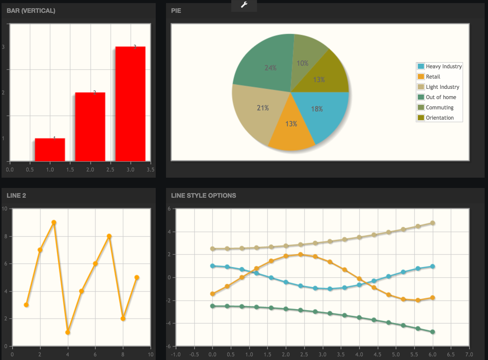
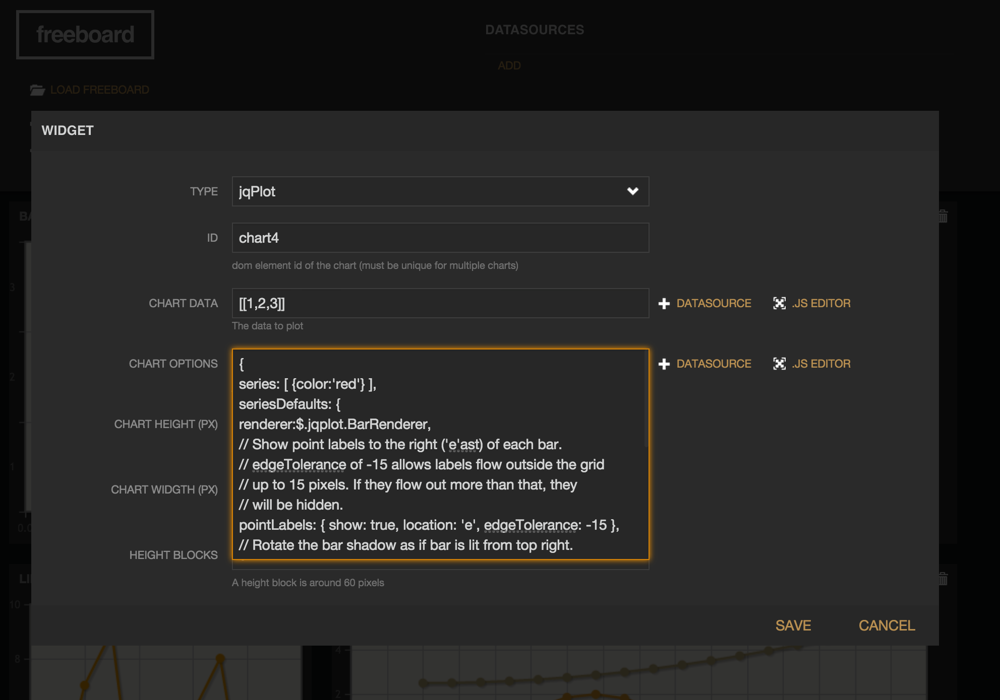

Freeboard jqPlot Widget Plugin
===============================

This is a widget plugin for [Freeboard](http://freeboard.io) (open source web ui dashboard) that allows dashboard widget authoring using [jqPlot](http://www.jqplot.com)





### Installation

Copy the plugin (index.js in this repo) to your freeboard installation, for example:

```
$ cp ./index.js /freeboard/plugins/jqplot
```

edit the [freeboard index.html file](https://github.com/Freeboard/freeboard/blob/master/index.html#L14) and add a link to the plugin near the end of the head.js script loader, like:

```
head.js(
  'js/freeboard_plugins.min.js',
  'plugins/jqplot/index.js',
  $(function() {
    //DOM Ready
    freeboard.initialize(true);
  })
```
